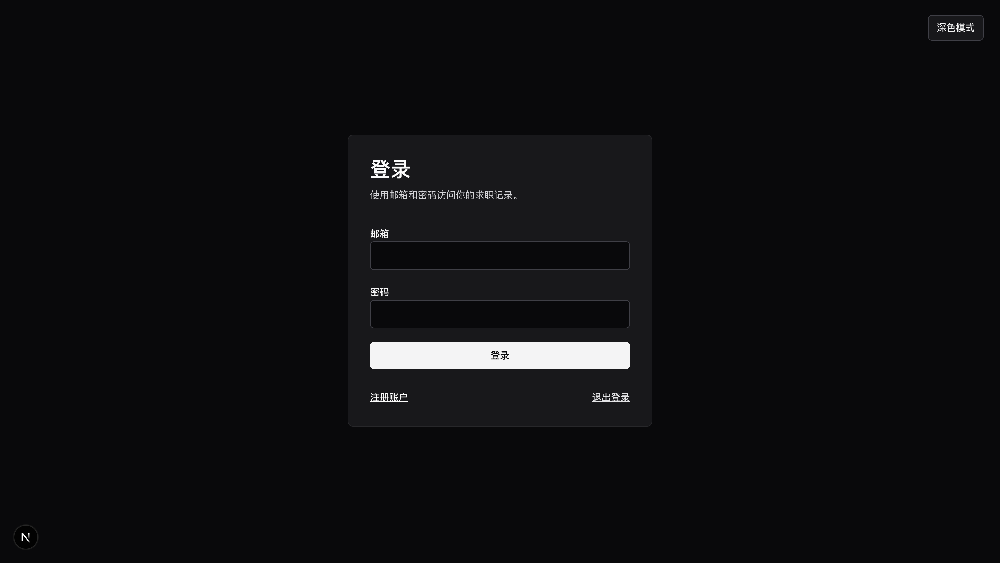
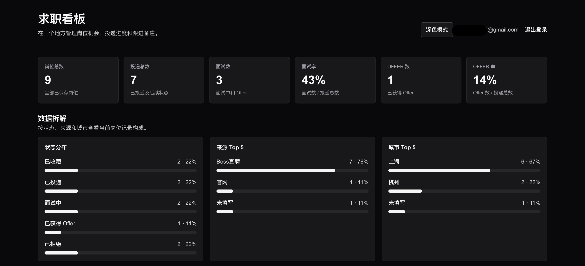
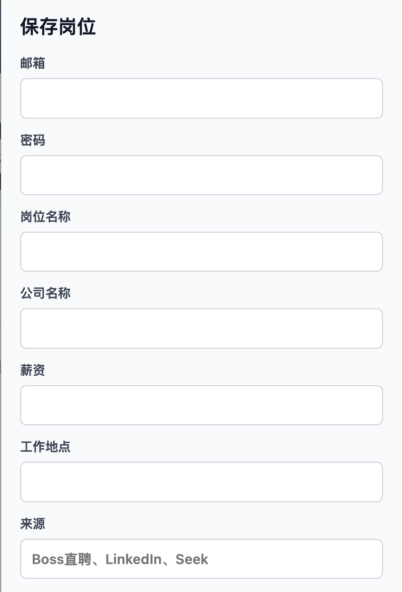
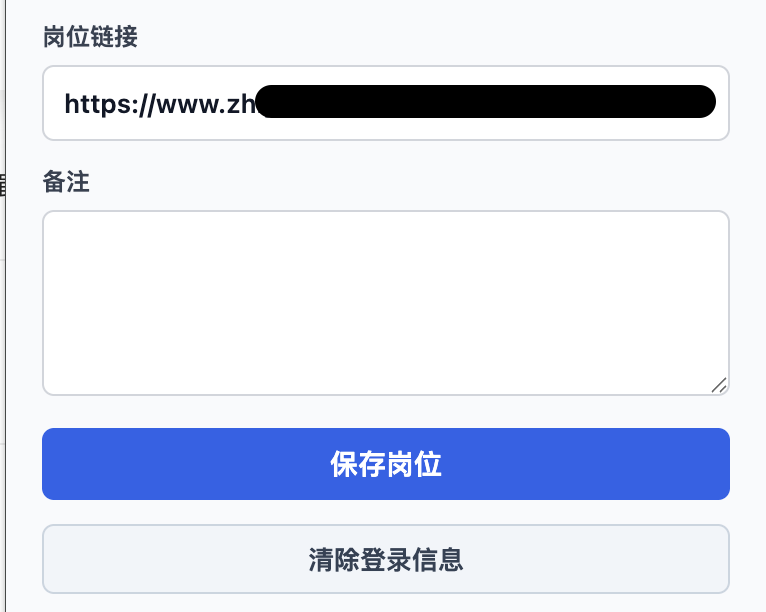
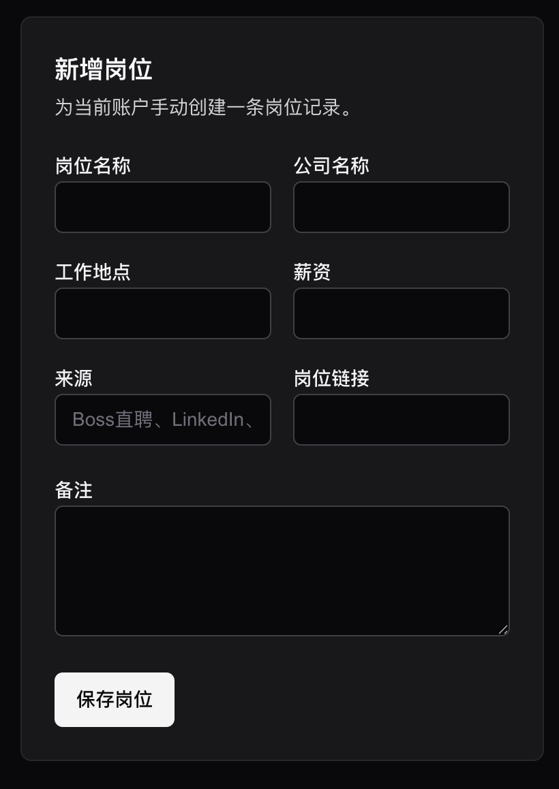

# Job Application Tracker

Live Demo: https://jobtrackerzephyr.xyz

Job Application Tracker 是一个求职进度管理工具，用于把不同招聘网站上的岗位记录集中保存到 Web Dashboard 中。当前版本包含 Supabase 登录、岗位 CRUD、统计看板和一个本地加载的 Chrome Extension MVP。

## 项目亮点

- 基于 Next.js + Supabase 构建的求职管理平台
- Chrome Extension 支持 Boss直聘岗位一键采集
- 支持岗位新增、编辑、删除、搜索、筛选和排序
- Analytics Dashboard 提供投递率、面试率和 Offer 率分析
- 支持浅色 / 深色主题切换
- 使用 Supabase Auth + RLS 实现用户数据隔离

## 功能列表

- 用户注册、登录和退出登录
- 登录后查看自己的岗位记录
- 手动新增岗位，支持公司、职位、链接、薪资、城市、来源和备注
- 更新岗位状态：已收藏、已投递、面试中、已获得 Offer、已拒绝
- 删除岗位记录
- Dashboard 搜索、状态筛选和排序
- Analytics Overview：岗位总数、投递总数、面试数、面试率、Offer 数、Offer 率
- Analytics Breakdown：状态分布、来源 Top 5、城市 Top 5
- 浅色 / 深色主题切换，并保存本地偏好
- Chrome Extension Popup 手动保存岗位到当前用户账户
- Boss 直聘页面基础自动解析：职位、公司、薪资、城市、来源
- Extension 保存岗位时按同一用户的完整 `job_url` 做重复检测

## 技术栈

- Next.js App Router
- React
- TypeScript
- Tailwind CSS
- Supabase Auth
- Supabase Postgres + Row Level Security
- Chrome Extension Manifest V3
- ESLint

## 本地启动

安装依赖：

```bash
npm install
```

创建本地环境变量文件：

```bash
cp .env.example .env.local
```

在 `.env.local` 中填写 Supabase 项目配置：

```bash
NEXT_PUBLIC_SUPABASE_URL=your-supabase-project-url
NEXT_PUBLIC_SUPABASE_ANON_KEY=your-supabase-anon-key
```

启动开发服务器：

```bash
npm run dev
```

打开：

```text
http://localhost:3000
```

常用路由：

- `/`
- `/login`
- `/signup`
- `/dashboard`
- `/logout`

## 环境变量

当前项目使用以下环境变量：

| 变量名 | 用途 | 是否可提交 |
| --- | --- | --- |
| `NEXT_PUBLIC_SUPABASE_URL` | Supabase 项目 URL | 只提交 `.env.example` 中的空占位，不提交真实值 |
| `NEXT_PUBLIC_SUPABASE_ANON_KEY` | Supabase anon public key，用于客户端和 API Route 按用户上下文访问 Supabase | 只提交 `.env.example` 中的空占位，不提交真实值 |

不要把 `.env`、`.env.local`、`.env.*.local` 或任何真实密钥提交到 GitHub。Supabase `service_role` key 不能放进前端代码、Chrome Extension 或公开仓库。

## Chrome Extension 使用说明

当前 Extension 位于 `extension/` 目录，默认连接线上站点：

```text
https://www.jobtrackerzephyr.xyz
```

1. 打开 Chrome 的 `chrome://extensions`
2. 开启 Developer mode
3. 点击 Load unpacked
4. 选择本项目的 `extension/` 目录
5. 使用线上站点账户的 Email / Password
6. 打开 Boss 直聘岗位页面
7. 点击扩展图标，检查自动填充字段
8. 点击保存岗位
9. 回到 `https://www.jobtrackerzephyr.xyz/dashboard` 查看岗位记录

注意：当前 MVP 会把 Email / Password 保存在 `chrome.storage.local`，仅用于本地测试便利。生产版本应改为更安全的 session、token 或 OAuth 方案。


## 登录页



## Analytics Dashboard



## Chrome Extension




## Page Display



## Future Roadmap

- Extension 认证改为 session、token 或 OAuth，不再保存密码
- Extension API 地址支持开发 / 生产环境配置
- 支持更多招聘网站解析
- Job URL 归一化，减少 query 参数导致的重复记录
- 岗位状态历史和时间线
- 日期趋势统计，例如周投递量、月投递量
- 更完整的图表展示
- 更安全的生产部署检查清单

## 项目文档

- 技术计划：[docs/TECHNICAL_PLAN.md](docs/TECHNICAL_PLAN.md)
- 变更记录：[docs/CHANGELOG.md](docs/CHANGELOG.md)
- 部署说明：[docs/DEPLOYMENT.md](docs/DEPLOYMENT.md)
